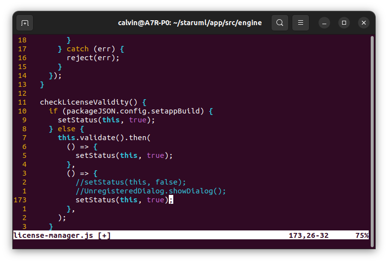
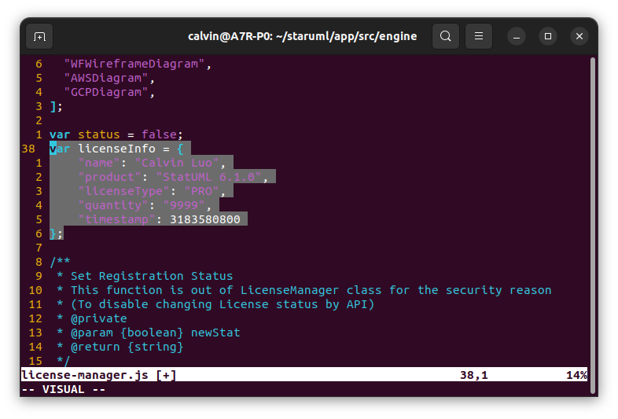
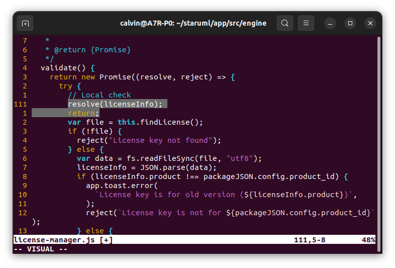
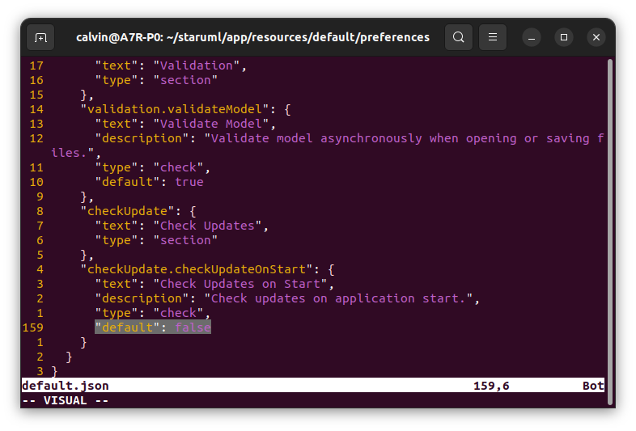

## Disclaimer
This is just a guide of edit file base on the keyboard, mouse and monitor, and only use for personal research and study, no commercial use

## Step 1: Download the lateste StarUML(6.1.0) and install it.
Go to the [StarUML download page](https://staruml.io/download/) and download the latest version. This guide is use the version 6.1.0
### For Windows users:
Click the downloaded .exe file to install StarUML.
### For Linux users open the terminal and type the following commands:
click the downloaded .deb file to install StarUML.
## Step 2: install the Node.js and using npm to install the asar.

### For Windows users:
Open the cmd and type the following commands:
```cmd
npm install asar -g
```

### For Linux users open the terminal and type the following commands:
```bash
sudo npm install asar -g
```

## Step 3: Extract the asar file.

### For Windows users:
Right click the StarUML desktop icon and select "Open the file location", this will open the StarUML directory. And go into the resourses directory, and copy the app.asar file to another folder(assume that the folder is C:\staruml). Open the cmd and switch to this directory:
```cmd
cd C:\staruml
```

Then extract the app.asar file:
```cmd
asar e app.asar .\app
```

### For Linux users:
Open the terminal and copy the app.asar(Linux version StarUML is install in /opt/StarUML) to another folder(assume that the folder is ~/staruml):
```bash
mkdir ~/staruml
sudo cp /opt/StarUML/resources/app.asar ~/staruml/
```

extract the app.asar file:
```bash
asar e app.asar ./app
```

## Step 4: Disable the Unregistered windows.

### For Windows users:
open a text editor and open the directory "C:\staruml\app\src\engine", find the file which named "license-manager.js". Open it and go to the line 171 and line 172 comment this two line and add a new line with following code.

```JavaScript
setStatus(this, true);
```

The code should be changed like this follow:



### For Linux users:
open a text editor(here will use vim as example) and open the file "~/staruml/app/src/engine/license-manager.js"
```bash
vim ~/staruml/app/src/engine/license-manager.js
```

Then go to the line 171 and line 172 comment this two line and add a new line with following code.
```JavaScript
setStatus(this, true);
```

The code should be changed like this follow:


Then save the file and exit by type this following code in vim.
```bash
:wq
```

## Step 5: Pack the app.asar file and replace the origin one.

### For Windows users:
cd in to the directory "C:\staruml" and type the following code in the cmd:
```cmd
asar pack app app-edit.asar
```

Then Right click the StarUML desktop icon and select "Open the file location", this will open the StarUML directory. And go into the resourses directory and paste the "app-edit.asar" file to replace the "app.asar" file(don't forget to change the file name to app.asar).

### For Linux users:
open the Terminal and type the following code in the directory "~/staruml":
```bash
asar pack app app-edit.asar
```

then copy the edited version to the StarUML directory by type following code in terminal:
```bash
sudo cp app-edit.asar /opt/StarUML/resourses/app.asar
```

## Step 6: Restart the StarUML to check the result.
It should not show the "Unregistered" message when you open the StarUML.

Then you can delete the useless folder "C:\staruml" (for Windows users) and "~/staruml" (for Linux users)

# For most people this will be enough.
You can enjoy using the StarUML.

***

# The following step will teach you how to change the license informations and disable the  auto update.


## Step 7: Change the license informations.

### For Windows users:
open the file "C:\staruml\app\src\engine\license-manager.js" and change the line 38 var licenseInfo = null to folloing code (don't forget to replace the name as your personal name):
```JavaScript
var licenseInfo = {
	"name": "replace_with_your_name",
	"product": "StatUML 6.1.0",
	"licenseType": "PRO",
	"quantity": "9999",
	"timestamp": 3183580800
};
```



then go to the line 111 and add the following code:
```JavaScript
resolve(licenseInfo);
return;
```
The code should be changed like following picture:



### For Linux users:
open the file "~/staruml/app/src/engine/license-manager.js" by typing the following command in the terminal:
```bash
vim ~/staruml/app/src/engine/license-manager.js
```

And change the line 38 var licenseInfo = null to folloing code;
```JavaScript
var licenseInfo = {
	"name": "replace_with_your_name",
	"product": "StatUML 6.1.0",
	"licenseType": "PRO",
	"quantity": "9999",
	"timestamp": 3183580800
};
```

The code shoud be changed like following picture:


then go to the line 111 and add the following code:
```JavaScript
resolve(licenseInfo);
return;
```
The code should be changed like following picture:


## Step 8: Disable the auto update

### For Windows users:
open the file "C:\strauml\app\src\resources\default/preferences/default.json" and change the line 159 true to false.
```JSON
"default": false
```

The code should be changed like following picture:



### For Linux users:
open the file "~/staruml/app/src/resources/default/preferences/default.json"
```bash
vim ~/staruml/app/src/resources/default/preferences/default.json
```

And change the line 159 true to false.
```JSON
"default": false
```

The code should be changed like following picture:


## Step 9: Repack
Redo the step 5 and 6. to check the effect.

## Compatibility
This guide is tested on Windows 11 and Ubuntu 22.04.4 LTS with StarUML 6.1.0.

## Known issues
### 1.Update StarUML version.
If you update the StarUML version, the app.asar file will be replace. So you need to re-crack the app.asar file by following this guide.